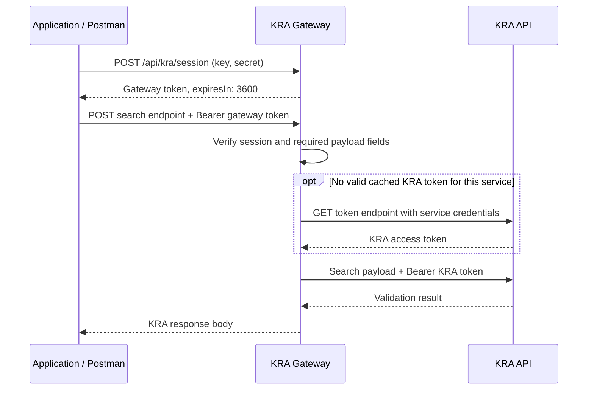

# KRA API Integration Guide

Version 1.0 | 14 September 2026

## 1. Purpose and scope

This guide explains how an application authenticates with the KRA gateway, searches for a taxpayer by PIN or ID, and validates a Tax Compliance Certificate (TCC). It includes Postman requests, response explanations, troubleshooting, and deployment configuration.

The gateway exposes one authentication flow for all three services. Your application uses its gateway key and secret to obtain a session token. The gateway uses the configured KRA credentials internally to obtain the appropriate upstream token for each search.

## 2. Integration flow



The gateway token is for gateway endpoints only. Treat it as an opaque value; do not decode it to implement client authentication. The session is not a guarantee that every KRA service is available or authorized.

## 3. Base URLs and endpoint summary

Local gateway base URL: `http://localhost:3000`.

For deployment, replace this with your application's public HTTPS gateway URL. Do not replace it with the KRA upstream URL when using a gateway token.

| Method | Gateway path | Purpose | Authentication |
| --- | --- | --- | --- |
| POST | `/api/kra/session` | Create a session | Gateway key and secret in JSON |
| POST | `/api/kra/pin` | Search by KRA PIN | Gateway Bearer token |
| POST | `/api/kra/pin-by-pin` | Alias for `/api/kra/pin` | Gateway Bearer token |
| POST | `/api/kra/pin-by-id` | Search by taxpayer ID | Gateway Bearer token |
| POST | `/api/kra/tcc` | Validate a TCC | Gateway Bearer token |
| GET | `/health` | Check the gateway process | None |

All POST bodies use `Content-Type: application/json`. Field names are case-sensitive and required payload values are non-empty strings.

## 4. Authentication and session creation

In Postman, choose **POST**, set the URL below, select **Authorization > No Auth**, and select **Body > raw > JSON**.

```http
POST http://localhost:3000/api/kra/session
Content-Type: application/json
```

```json
{
  "key": "<GATEWAY_CLIENT_KEY>",
  "secret": "<GATEWAY_CLIENT_SECRET>"
}
```

| Field | Type | Required | Description |
| --- | --- | --- | --- |
| `key` | string | Yes | Application key configured in `GATEWAY_CLIENT_KEY` |
| `secret` | string | Yes | Application secret configured in `GATEWAY_CLIENT_SECRET` |

These are the gateway credentials, not a KRA consumer key and secret. No `service` field is required.

Successful HTTP 200 response:

```json
{
  "token": "<gateway-session-token>",
  "tokenType": "Bearer",
  "expiresIn": 3600,
  "services": ["pin", "pin-by-id", "tcc"]
}
```

| Response field | Meaning |
| --- | --- |
| `token` | Token to present on all gateway searches |
| `tokenType` | Authorization scheme: `Bearer` |
| `expiresIn` | Lifetime in seconds: 3,600 seconds equals one hour |
| `services` | Gateway services available through this session; not a KRA entitlement check |

For searches, select **Authorization > Bearer Token** and paste only the token value. Do not include quotes, line breaks, or the word `Bearer` in Postman's Token box.

```http
Authorization: Bearer <gateway-session-token>
Content-Type: application/json
```

Create a new session when the previous one expires. There is no refresh-token endpoint or individual logout/revocation endpoint. Rotating either gateway credential invalidates existing sessions. A normal restart with unchanged gateway credentials preserves unexpired sessions.

## 5. Search by PIN

```http
POST http://localhost:3000/api/kra/pin
Authorization: Bearer <gateway-session-token>
Content-Type: application/json
```

```json
{
  "KRAPIN": "A948312567Q"
}
```

| Field | Type | Required | Description |
| --- | --- | --- | --- |
| `KRAPIN` | string | Yes | KRA PIN to look up |

`/api/kra/pin-by-pin` accepts the same request. Do not send a TCC payload to either PIN route.

### Confirmed sandbox response

The following HTTP 200 response was supplied from the successful Postman test:

```json
{
  "ResponseCode": "23000",
  "Message": "Valid PIN",
  "Status": "OK",
  "PINDATA": {
    "KRAPIN": "A948312567Q",
    "TypeOfTaxpayer": "Individual",
    "Name": "Test Test",
    "StatusOfPIN": "Active"
  }
}
```

| Response field | Explanation |
| --- | --- |
| `ResponseCode` | KRA business response code; `23000` accompanies the successful PIN result shown |
| `Message` | Human-readable result: `Valid PIN` |
| `Status` | Business outcome: `OK` in this response |
| `PINDATA.KRAPIN` | PIN returned by KRA |
| `PINDATA.TypeOfTaxpayer` | Taxpayer classification, here `Individual` |
| `PINDATA.Name` | Name returned for the taxpayer; this is a sandbox test name |
| `PINDATA.StatusOfPIN` | PIN registration status, here `Active` |

This result confirms the sample PIN lookup succeeded. An active PIN does not establish that a taxpayer has a valid TCC. Use the TCC endpoint for that check. Do not use the example name or identifiers as verified production identity data.

## 6. Search by taxpayer ID

```http
POST http://localhost:3000/api/kra/pin-by-id
Authorization: Bearer <gateway-session-token>
Content-Type: application/json
```

```json
{
  "TaxpayerType": "KE",
  "TaxpayerID": "41789723"
}
```

| Field | Type | Required | Description |
| --- | --- | --- | --- |
| `TaxpayerType` | string | Yes | Taxpayer category; `KE` is used in the tested sample |
| `TaxpayerID` | string | Yes | Identifier for that category; preserve leading zeros and letters |

The gateway currently checks these fields for non-empty strings; KRA determines whether the supplied category and identifier are valid.

### Confirmed sandbox response

The earlier successful Postman test supplied this HTTP 200 response:

```json
{
  "ResponseCode": "30000",
  "TaxpayerPIN": "A744610021G",
  "TaxpayerName": "BANYI02 TEST ENNIS02"
}
```

| Response field | Explanation |
| --- | --- |
| `ResponseCode` | KRA business response code; `30000` appears in this successful sample |
| `TaxpayerPIN` | PIN associated with the supplied taxpayer identifier |
| `TaxpayerName` | Taxpayer name returned by KRA |

This endpoint returns the KRA lookup result. It does not provide a general IPRS identity record or a TCC validation result.

## 7. Validate a Tax Compliance Certificate

```http
POST http://localhost:3000/api/kra/tcc
Authorization: Bearer <gateway-session-token>
Content-Type: application/json
```

```json
{
  "kraPIN": "A948312567Q",
  "tccNumber": "K92OR548W43A21N9"
}
```

| Field | Type | Required | Description |
| --- | --- | --- | --- |
| `kraPIN` | string | Yes | PIN associated with the certificate |
| `tccNumber` | string | Yes | Certificate number to validate |

The capitalization differs from PIN lookup: TCC requires `kraPIN`, while PIN lookup requires `KRAPIN`.

The gateway passes through KRA's TCC response body. No actual successful TCC response body was supplied for this guide; the user reported that TCC was working. Capture an authorized successful response before relying on a fixed TCC response schema. Do not infer certificate validity from HTTP 200 alone: inspect the returned business result and any certificate status and validity dates.

## 8. Health check

```http
GET http://localhost:3000/health
```

```json
{
  "status": "ok",
  "service": "kra-api-gateway"
}
```

No credentials or payload are required. A successful health check confirms the gateway process responds; it does not test KRA credentials or connectivity.

## 9. Error handling and troubleshooting

Gateway validation/authentication errors normally contain `message`. Named KRA integration errors contain `code` and `message`; API-product mismatch errors also include `fault`. Other upstream error bodies can retain KRA's own structure and field casing.

| HTTP status / code | Meaning | Next step |
| --- | --- | --- |
| 400 | Missing/blank fields, wrong value types, or invalid JSON | Check exact field names and send strings in valid JSON |
| 401, gateway authentication message | Incorrect gateway credentials or invalid/expired session | Check gateway login values or create a new session |
| 401, `KRA_CREDENTIALS_REJECTED` | KRA token exchange rejected the selected service's credentials | Check that service's KRA pair and selected environment; restart after editing `.env` |
| 403, `KRA_API_PRODUCT_MISMATCH` | KRA token is not authorized for the upstream API product | Check app product access for the method, path, and environment |
| 404 | Gateway route or method does not match | Use a route and method from the endpoint table |
| 413 | JSON request exceeds 10 KB | Reduce request size |
| 429 | IP request limit exceeded | Wait for the `Retry-After` duration |
| 503, gateway configuration message | Gateway key or secret is missing | Configure both gateway credential variables |
| 503, `KRA_CREDENTIALS_MISSING` | Required service credential values are missing or placeholders | Configure the variables named in the response |
| 502, `KRA_INVALID_TOKEN_RESPONSE` | KRA token response contains no access token | Investigate upstream token response |
| 502, `KRA_UNAVAILABLE` | Could not connect to KRA | Check network and selected upstream URL |
| 504, `KRA_TIMEOUT` | KRA did not respond within the 15-second request timeout | Retry later with bounded backoff |
| 500 | Unexpected internal gateway failure | Review server logs |

Example local payload error:

```json
{
  "message": "KRAPIN is required"
}
```

The earlier PIN credential-rejection response occurred before the PIN lookup. The later `23000` / `Valid PIN` result confirms a successful lookup after that issue. Recreating a gateway session alone does not correct rejected KRA credentials.

## 10. Sandbox and production setup

Current configuration supports these settings:

```env
KRA_ENV=sandbox
KRA_BASE_URL=https://sbx.kra.go.ke
KRA_PRODUCTION_BASE_URL=https://api.kra.go.ke
```

Set `KRA_ENV=production` and restart to select production. Set it back to `sandbox` and restart to return to sandbox. Use origins only, without endpoint paths. Optional `KRA_SANDBOX_BASE_URL` overrides the legacy sandbox `KRA_BASE_URL`; production uses `KRA_PRODUCTION_BASE_URL`.

As specified for this project, both environments use the same KRA credential pairs:

| Service | Key variable | Secret variable |
| --- | --- | --- |
| PIN | `KRA_PIN_BY_PIN_CONSUMER_KEY` | `KRA_PIN_BY_PIN_CONSUMER_SECRET` |
| ID | `KRA_PIN_BY_ID_CONSUMER_KEY` | `KRA_PIN_BY_ID_CONSUMER_SECRET` |
| TCC | `KRA_TCC_CONSUMER_KEY` | `KRA_TCC_CONSUMER_SECRET` |

Application credentials are `GATEWAY_CLIENT_KEY` and `GATEWAY_CLIENT_SECRET`. Keep actual credentials and tokens out of shared documentation. Production startup validates required credentials, a gateway secret of at least 32 characters, and a non-sandbox HTTPS upstream origin.

### Upstream destinations configured in the gateway

| Service | Method | Sandbox | Production |
| --- | --- | --- | --- |
| PIN | POST | `https://sbx.kra.go.ke/checker/v1/pinbypin` | `https://api.kra.go.ke/checker/v1/pinbypin` |
| ID | POST | `https://sbx.kra.go.ke/checker/v1/pin` | `https://api.kra.go.ke/checker/v1/pin` |
| TCC | POST | `https://sbx.kra.go.ke/v1/kra-tcc/validate` | `https://api.kra.go.ke/v1/kra-tcc/validate` |

Internal token exchange uses **GET** `/v1/token/generate?grant_type=client_credentials` on the selected KRA origin with Basic authentication. Search calls use the resulting KRA Bearer token. The gateway caches upstream tokens separately for each service/credential pair and obtains a new token after cache expiry.

The production TCC URL was supplied by the project owner. These mappings describe the implementation; production availability and permissions have not been verified.

## 11. Running and checking the integration

```powershell
npm.cmd install
npm.cmd run dev
```

For deployment, set `NODE_ENV=production`, configure the appropriate `KRA_ENV`, and run `npm.cmd start`. Expose the gateway through HTTPS and configure secrets in the deployment environment.

```powershell
npm.cmd test
```

Local tests use mocked KRA transport and exercise authentication, payload forwarding, route aliases, failure handling, and environment configuration. They do not establish live KRA product access.

```powershell
node scripts/smoke-sandbox.js
```

The smoke script sends the configured credentials and sample identifiers to the selected sandbox, starts a temporary local gateway instance, and tests health, session, PIN, PIN alias, ID, and TCC. It refuses production mode. It prints HTTP/result codes without secrets, tokens, or taxpayer names; a zero HTTP-error count still requires interpreting business results.

## 12. Operational limits and verification status

The gateway applies a 10 KB JSON body limit and 100 requests per IP per 60-second window, including session and health requests. `Retry-After` is returned when limited. Helmet and no-store response headers are enabled; CORS is disabled. Rate limiting and KRA token caching are per-process. Multiple instances require shared gateway credentials and deployment-specific proxy/rate-limit planning.

| Capability | Evidence available for this guide |
| --- | --- |
| Session creation | User-supplied HTTP 200 response with one-hour session |
| PIN lookup | User-supplied HTTP 200 / `23000`, `Valid PIN`, `Active` |
| ID lookup | User-supplied HTTP 200 / `30000` with PIN and name |
| TCC lookup | Reported working by user; actual response body not supplied |
| Production | URL configuration implemented; live access unverified |

This guide is based on the repository implementation and responses supplied in this project. The earlier IPRS document was not present in the workspace, so its exact formatting could not be reproduced.
